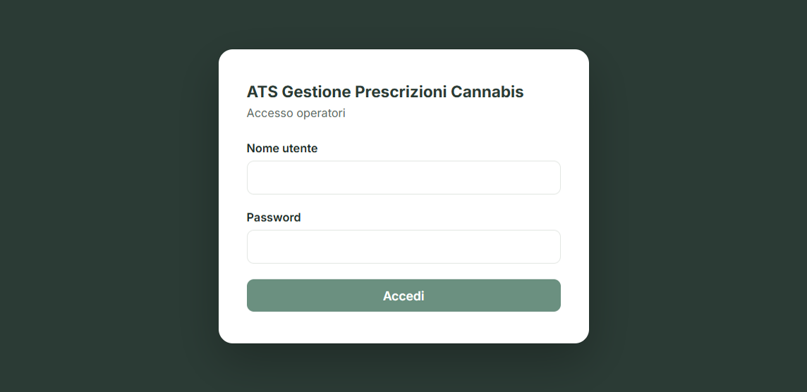
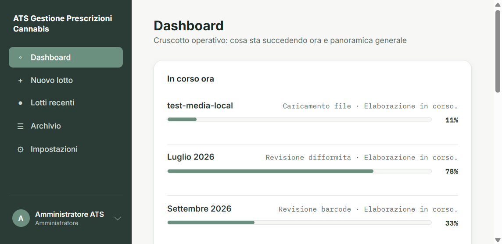
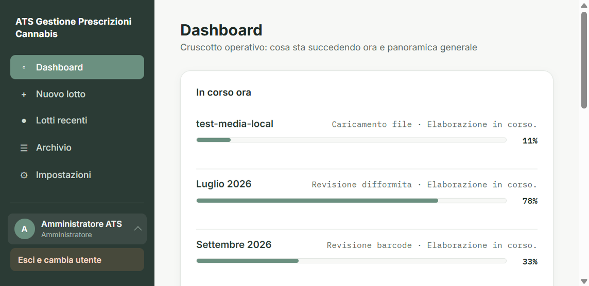
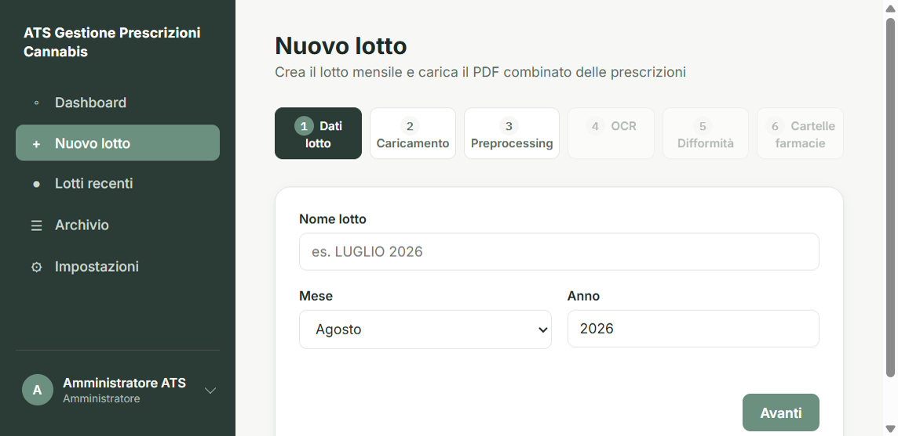
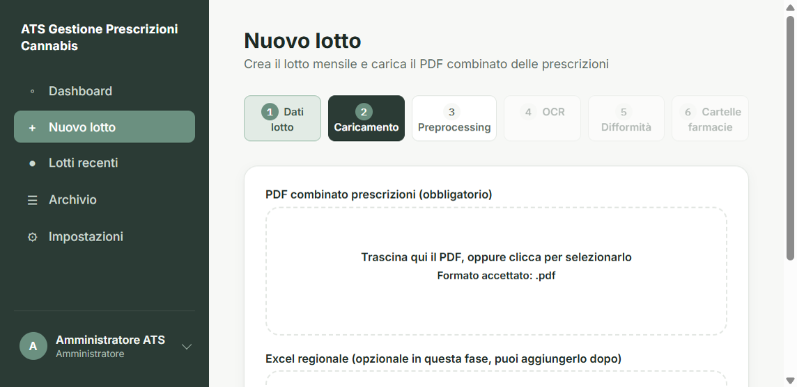
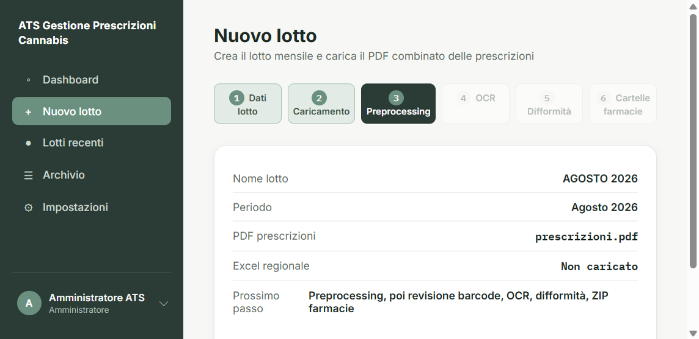
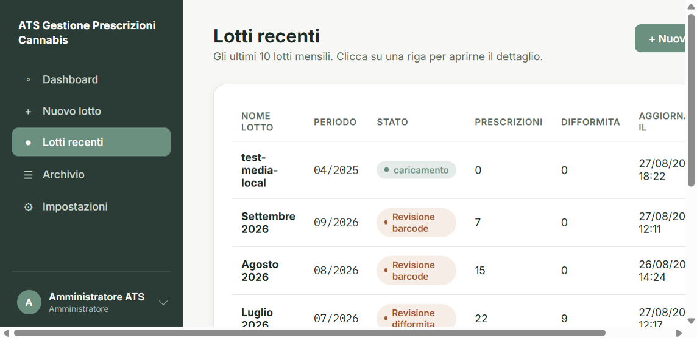
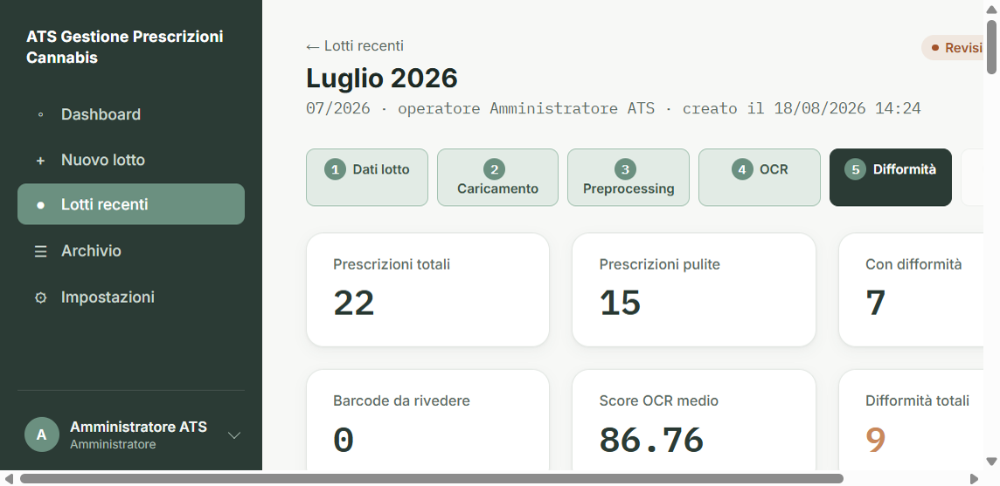
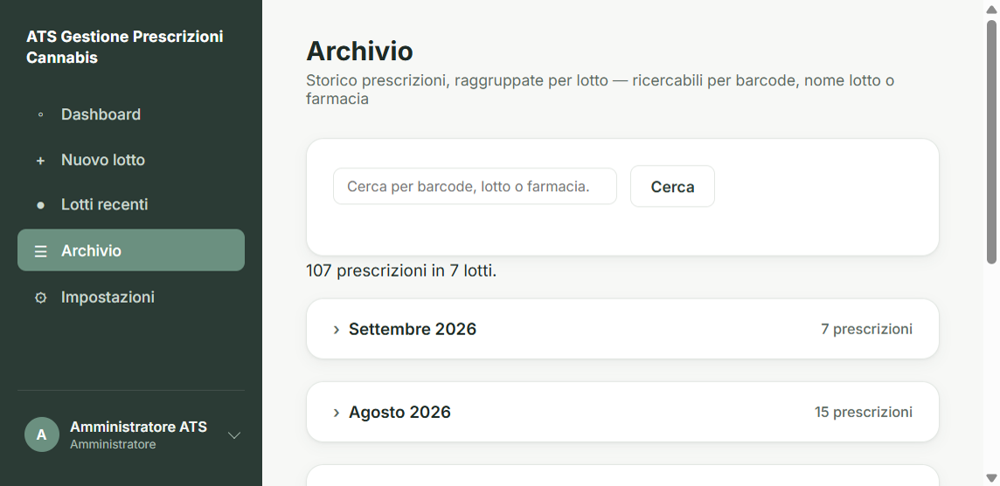
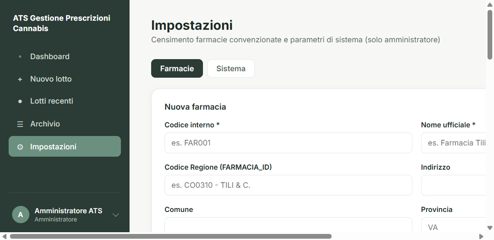

# Guida per gli operatori ATS

**ATS Gestione Prescrizioni Cannabis** è l’applicazione interna per elaborare i lotti mensili di ricette di cannabis terapeutica: caricamento PDF, controllo automatico (lettura barcode e testo), revisione da parte vostra, file Excel e cartelle per farmacia.

Questa guida non entra nei dettagli tecnici (Docker, GPU, server). Serve per usare l’interfaccia e per la formazione.

Gli screenshot sono nella cartella `docs/screen/` (stesso pacchetto documentazione).

---

## Accesso

L’indirizzo ve lo comunica il referente informatico (di solito `http://` più nome del PC ATS e porta `8000`).

1. Inserire **nome utente** e **password**.
2. **Accedi**.

Se le credenziali non sono corrette compare un avviso: non si entra.

Chi è già collegato e riapre la pagina di accesso viene portato alla dashboard.

---

## Menu a sinistra

Sempre visibile dopo il login:

| Voce | A cosa serve |
|------|----------------|
| **Dashboard** | Cosa sta girando ora e numeri di sintesi (lotti, ricette, filtri per periodo) |
| **Nuovo lotto** | Parte un lotto nuovo (PDF del mese) |
| **Lotti recenti** | Elenco degli ultimi lotti, click sulla riga per il dettaglio |
| **Archivio** | Storico ricette, ricerca per barcode, nome lotto o farmacia |
| **Impostazioni** | Solo per l’amministratore: anagrafe farmacie |

In basso a sinistra vedete **il vostro nome** e il ruolo (amministratore, operatore, revisore).

---

## Uscire e cambiare utente

1. Cliccare sul **nome** in fondo al menu.
2. Compare **Esci e cambia utente**.
3. Si torna alla schermata di accesso: entrare con un altro account.

Non chiudete solo la scheda del browser se un collega deve entrare con un altro utente sullo stesso PC: fate **Esci**.

---

## Dashboard

- **In corso ora**: lotti con elaborazione automatica attiva (barra di avanzamento). Click sul nome per aprire il dettaglio.
- **Panoramica**: filtri anno / mese / stato e riquadri con i totali.

Se non c’è nulla in lavorazione, un messaggio invita a creare un lotto.

---

## Nuovo lotto

Il percorso è a **sei tappe**. Le prime tre le compilate voi; le successive si sbloccano quando il sistema lavora e quando voi confermate le revisioni.

### 1. Dati lotto

- Nome (es. `AGOSTO 2026`)
- Mese e anno

### 2. Caricamento

- **PDF combinato** delle prescrizioni: obbligatorio (trascinare o cliccare).
- **Excel regionale**: facoltativo in questo momento; si può aggiungere dopo. Utile per i controlli di coerenza con i dati Regione.

### 3. Conferma

Riepilogo e avvio. Da qui parte la lettura automatica dei barcode (preprocessing).

**Importante:** non si possono far partire **due elaborazioni automatiche insieme** (due OCR/Docker). Se un lotto sta già lavorando in macchina, il sistema avvisa di aspettare. I lotti fermi in “revisione” (attesa di un click vostro) non bloccano un nuovo caricamento.

I tempi di OCR su tante ricette possono essere **lunghi** (decine di minuti o più): non è un blocco, è il modello di lettura.

---

## Lotti recenti e dettaglio

Da **Lotti recenti** si apre il lotto. In alto lo **stato** (badge colorato) e le stesse sei tappe.

Durante una fase automatica vedete i log, la percentuale e i pulsanti:

- **Metti in pausa** / **Riprendi**
- **Annulla** (il lotto va in errore; si può **Riprova** se qualcosa si è interrotto)

### Cosa vi chiede il programma, in ordine

1. **Revisione barcode** — ricette il cui codice a barre non è stato letto: assegnare il codice o escludere la ricetta. Si può aprire il **PDF** originale. Finché restano barcode da sistemare, l’OCR non parte.
2. **OCR** — lettura automatica dei campi (dati paziente, etichetta, farmacia, …).
3. **Revisione qualità** — controllo di quanto letto; eventuale correzione.
4. **Difformità** — segnalazioni di non conformità (codici interni). Si può filtrare per gravità (bloccanti / minori). Confermare o scartare secondo le istruzioni operative ATS.
5. **Chiusura** — generazione Excel finale e, quando il lotto è **completato**, download Excel e **ZIP per farmacia**. Poi si può **archiviare**.

---

## Archivio

Ricerca per barcode, nome lotto o farmacia. I risultati sono raggruppati per lotto (si apre/chiude il gruppo). Da lì si torna al dettaglio completo.

---

## Impostazioni (amministratore)

Due schede:

- **Farmacie**: elenco convenzionate (codice, nome, codice Regione, indirizzo, contatti). Aggiunta, modifica, disattivazione, eliminazione, scarico CSV. L’elenco attivo viene usato in lettura automatica (riconoscimento farmacia).
- **Sistema**: parametri tecnici in sola lettura (percorsi, soglie). La modifica da schermata arriverà in un secondo momento.

L’operatore **non** vede questa voce di menu.

---

## Domande frequenti (linguaggio non tecnico)

**Due elaborazioni insieme?**  
No, non due “macchine” di lettura insieme. Aspettare che finisca quella in corso, oppure lavorare sulle revisioni di un lotto già fermo.

**Ho sbagliato utente?**  
Esci dal nome in basso a sinistra e rientra.

**Si è fermato con un avviso rosso?**  
Pulsante **Riprova**. Se non basta, avvisare il referente (spesso Docker/Ollama non in esecuzione).

**Posso lavorare da casa sul telefono?**  
L’uso previsto è dal PC in ATS, schermo grande.

**I dati delle ricette dove finiscono?**  
Nel sistema ATS (database + cartelle file). Non copiare screenshot con codice fiscale in chat o email non autorizzate.

---

## Assistenza

Per problemi di accesso, password o server: referente interno ATS / team di progetto (Lorenzo, Francesco, Alessandro).

Questa guida descrive l’interfaccia a agosto 2026. Se una schermata è diversa, fate riferimento a quanto vedete sul PC e segnalatelo.
